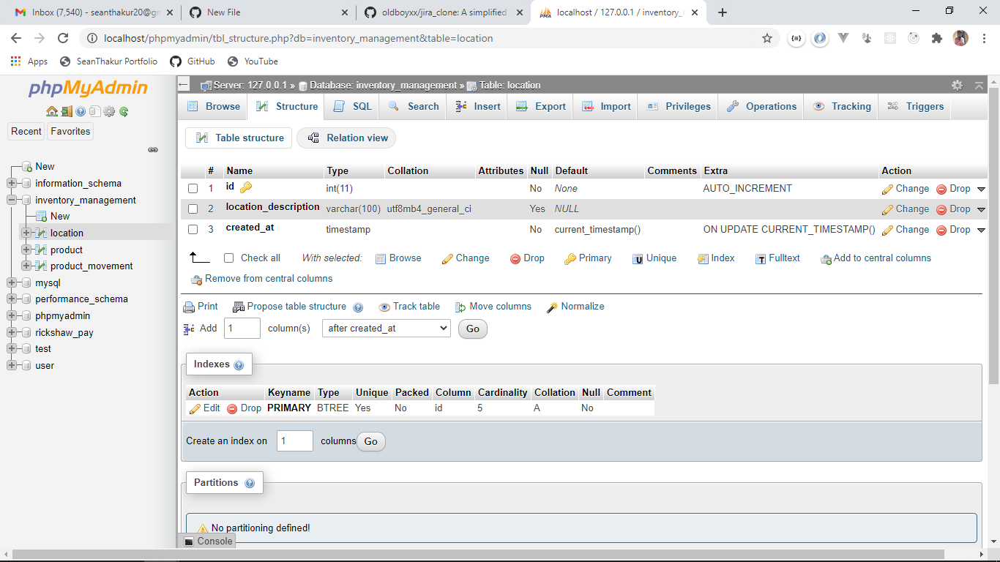
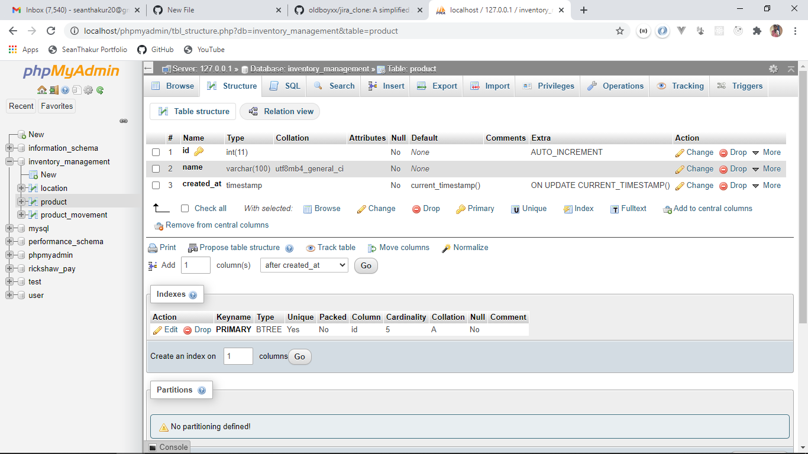
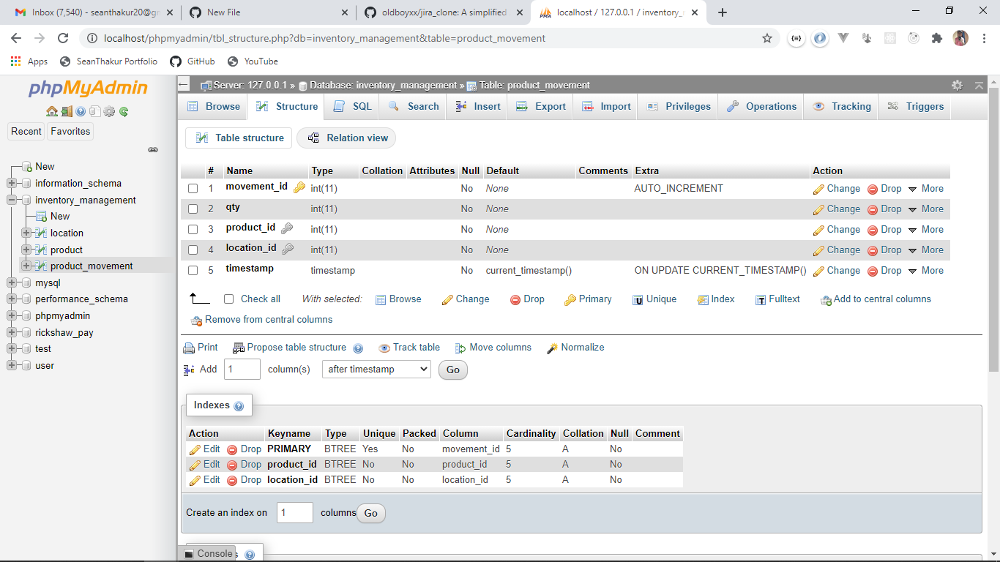
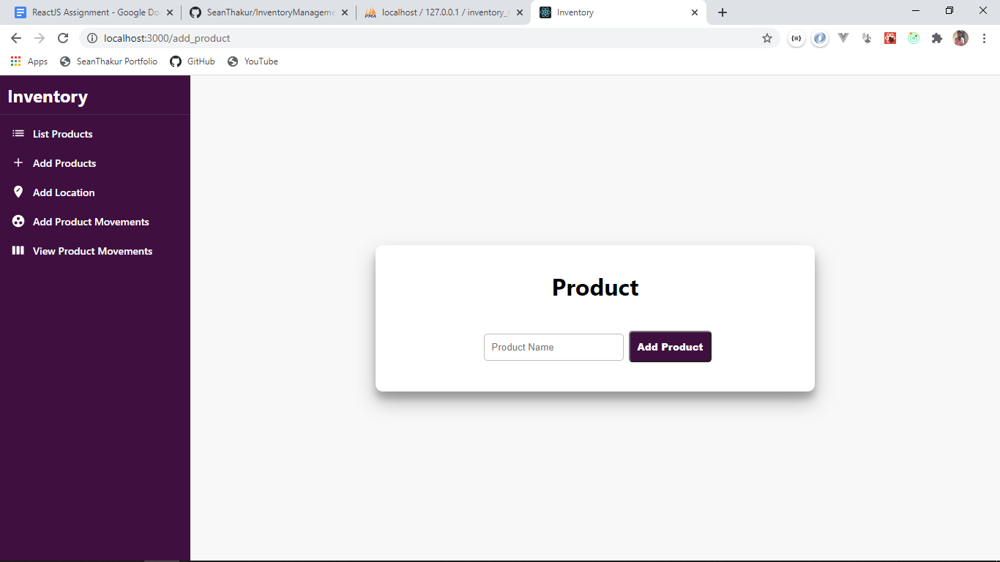
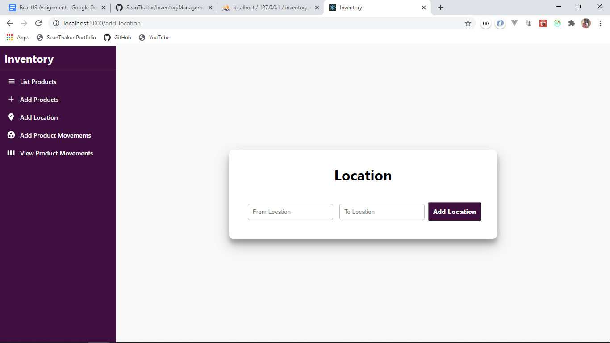
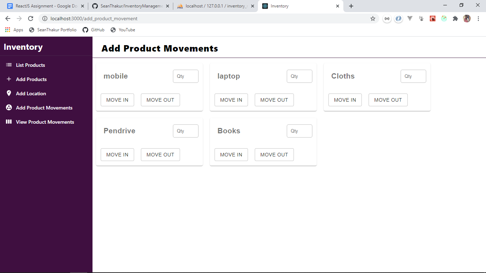
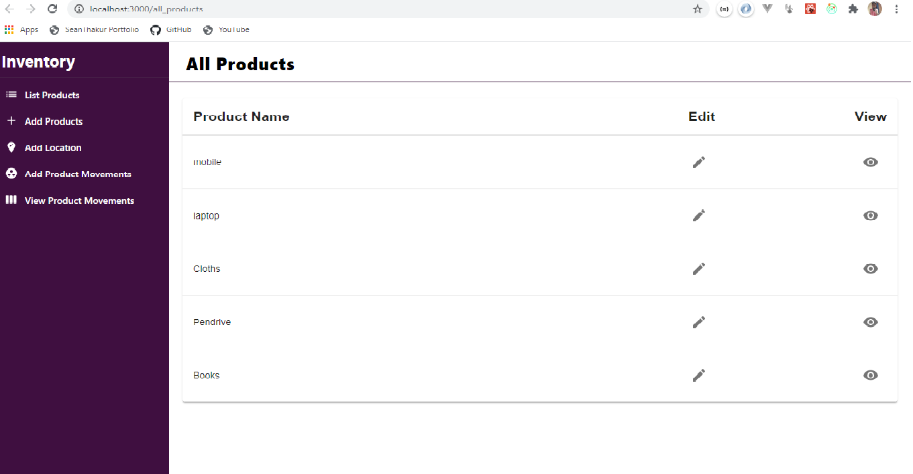
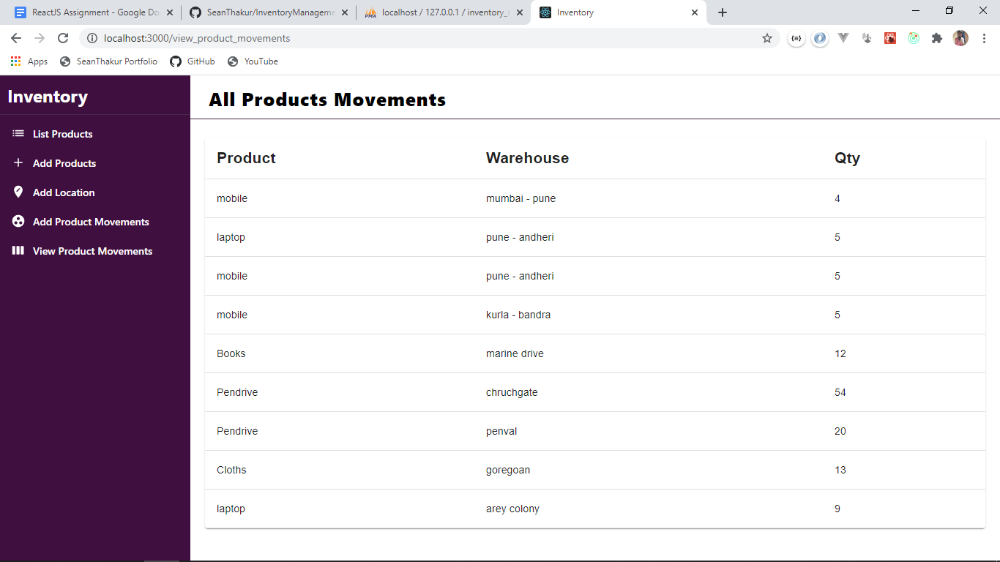

# InventoryManagement

I have used react js for frontend along with material ui core/icon for components and redux for state management, for backend i have used node js with express js along with
mysql for database connection

Setting up Instructions

Install Mysql if you don't have it already and create a database named  inventory_management.

use XAMPP CONTROL PANEL for your mysql connection

Below i have provided the schema of the tables i have used in this database

-  Location table Schema

-  Product table Schema

-  Product Movement table Schema

git clone https://github.com/SeanThakur/InventoryManagement.git

In the config folder you will find db.js file update your credentials (host, user and password)

For installing dependencies to server side and client side run 
- 
npm install and npm run client-install  
in your base loaction

After installing dependencies, run this command 
-  npm run dev

App should now be running on http://localhost:3000/

-  Images of the Project.

-  `Add Product Page`

-  `Add Location Page`

-  `Add Product Movement Page`

-  `All Product Page`

-  `Add View Product Movement Page`

